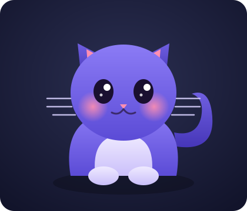

# 🐱 Miaou

**Un compagnon félin virtuel qui vit dans le navigateur — mignon, ultra-fluide, et pensé pour le partage.**

Trois couches, un même chat :
🖥️ un **compagnon de bureau** façon Tamagotchi · 🧶 un **occupe-chat** pour ton vrai félin resté seul · 📱 un **pont téléphone ↔ maison** pour le filmer, lui parler et lui lancer un jeu à distance.

---

## 🧭 Le projet

> Nom de code **Miaou** (provisoire). Ce dépôt démarre par la **planification** ;
> le code arrive au fil des sprints.

- 📖 **[GUIDELINE.md](GUIDELINE.md)** — vision, piliers, principes, architecture, stack, Definition of Done.
- 📊 **[Dashboard des sprints](dashboard/index.html)** — roadmap et suivi (s'ouvre dans le navigateur).

## 🐾 Les trois piliers

|     | Pilier        | En bref                                                              |
| --- | ------------- | -------------------------------------------------------------------- |
| 🖥️  | **Companion** | Compagnon de bureau vivant : humeurs, besoins, câlins, customisation |
| 🧶  | **Playroom**  | Jeux plein écran pour occuper ton vrai chat (proie, pelote, laser)   |
| 📱  | **Home**      | Filmer, parler, et lancer un jeu à distance depuis le téléphone      |

**Fil rouge :** chaque moment mignon est capturable et partageable (opt-in).

## 🛠️ Stack

**Vite · TypeScript · Svelte 5 · WebGPU · WebRTC · PWA** — évolutif vers Tauri
(desktop pet natif), un backend cloud, et du hardware (ESP32) plus tard.

## 🗺️ Roadmap

Vue d'ensemble dans la [GUIDELINE](GUIDELINE.md#9-roadmap-vue-densemble), suivi détaillé
dans le [dashboard](dashboard/index.html). **Prochain :** Sprint 0 — Fondations & outillage.

## 🤝 Contribuer

Voir [CONTRIBUTING.md](CONTRIBUTING.md) et le [Code de conduite](CODE_OF_CONDUCT.md).

## 📄 Licence

[MIT](LICENSE).

Fait avec 🐈 et beaucoup de fluidité.

